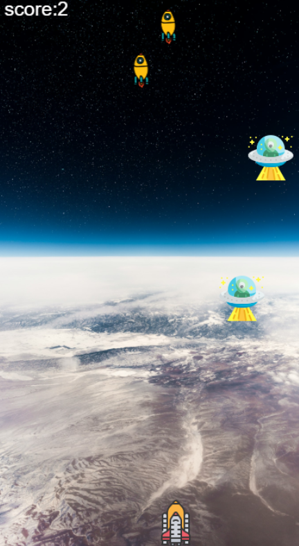

# JAVASCRIPT 슈팅게임 🎮🎮🎮<br/><br/>
```plaintext
    자바스크립스틀 활용한 슈팅게임입니다.
```

<a herf="">슈팅게임 바로가기(클릭)</a><br/>

 
## ★캔버스 세팅

---

◎ ctx를 활용해 2d 캔버스 설정 -> html에 연동<br/>
◎ `https://icons8.com/` 아이콘 사용<br/>
◎ render 함수를 통해 UI에 이미지 적용 -> 지속적인 render로 애니메이션 효과(requestAnimationFrame)<br/>
◎ 우주선 좌표 -> 계속적으로 변경됨 (가로 200 - 30 [절반기준])(높이 700 - 60)<br/>


## ★키보드세팅
---
◎ keysDown에 키를 눌렀을때 setupKeyboardListener에 저장 그리고 키를 뗀다면 삭제해준다.<br/>
◎ 키보드 각 고유의 번호에 해당하는 기능을 부여<br/>

## ★우주선 위치 변경 
---
◎ **_방향키_** 를 누르면 우주선의 x,y좌표가 바뀌고 다시 render<br/>
◎ addEventListener에서 keycode의 입력값을 받고 키보드의 클릭 유무 판단 <br/>
◎ **_우주선_** <u>이 캔버스 밖으로 나가지 않게 하는 것(0~400px)</u> 범위<br/>
◎ 끝지점은 우주선의 가로크기 canvas.width에서 60px을 빼준다

## ★총알 발사
---

◎ Bullet=> 총알정보 createBullet 총알 생성<br/>
◎ 스페이스 바를 누르면 발사(우주선의 x좌표에서 시작 y가 줄어듬)<br/>
◎ 총알은 위로 발사됨 -> y의 좌표 값이 줄어든다 -> 업데이트를 통해 계속적으로 적용<br/>
◎ 총알은 여러번 발사될 수 있음, 적 우주선과 반응한다. <br/>
◎ 모든 총알은 x,y좌표가 있음 (총알 클래스를 따로 분리 함수 포함) <br/>
◎ 배열로 저장 후 계속 render<br/>

## ★적군 생성 
---

◎ 바닥에 닿으면 게임이 끝남 <br/>
◎ 적군의 위치는 랜덤한 위치에서 1초마다 생성 generateRamdomValue(Math.random) & setInterval사용(max와 min으로 제어)<br/>
◎ y의 값을 계속적으로 업데이트 적군은 List에 저장<br/>

## ★적군 사격
---

◎ 총알이 적군의 바닥 즉 적군의 y보다 작고 적군의 x좌표의 안쪽에 위치하면 명중 <br/>
◎ 명중시 점수가 오르고 총알과 적군이 사라짐 (splice) & render에서 총알은 alive의 여부에 따라 구분<br/>
◎ checkHit 함수로 총알의 적중 여부를 판단하고 적중하면 score가 1점씩 올라감 alive로 총알 삭제 선택 <br/>
◎ splice로 적중한 적은 잘라낸다.<br/>


## ★게임 오버
---

◎ 적군이 y축 (canvas.heigth - 64(적군의 높이))의 높이에 도달하면 게임오바<br/>
◎ gameover의 값이 true로 바뀌면 끝<br/>
◎ main함수를 꺼버리면 게임 중단<br/> 